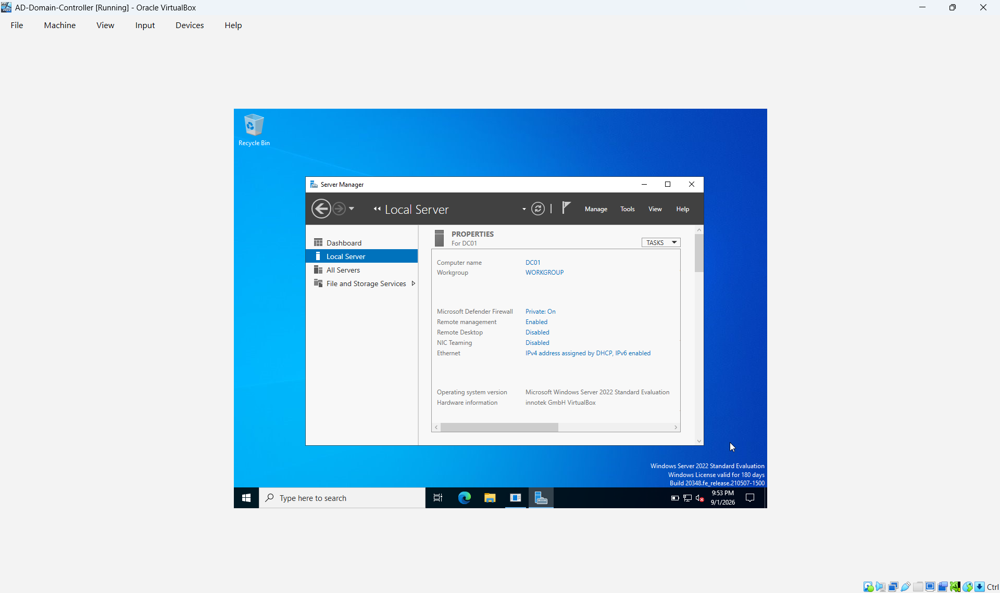
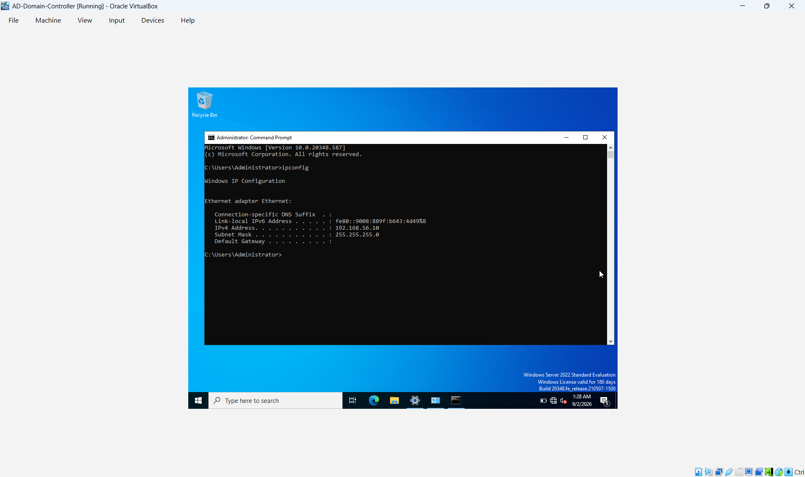
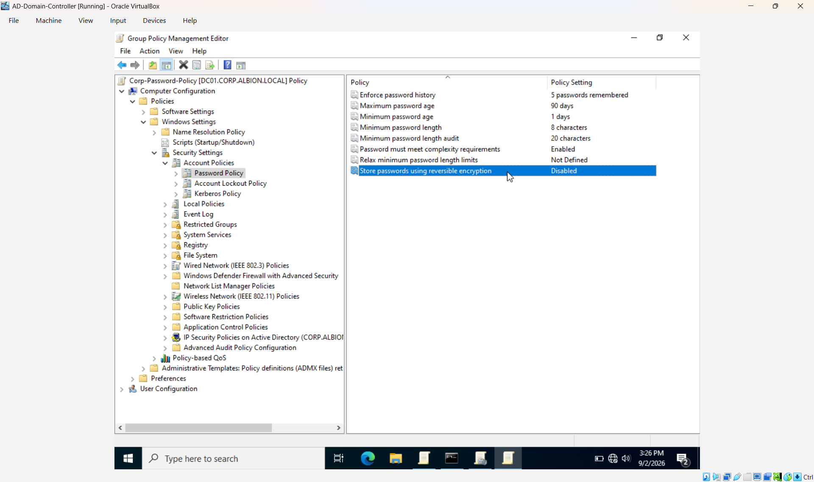
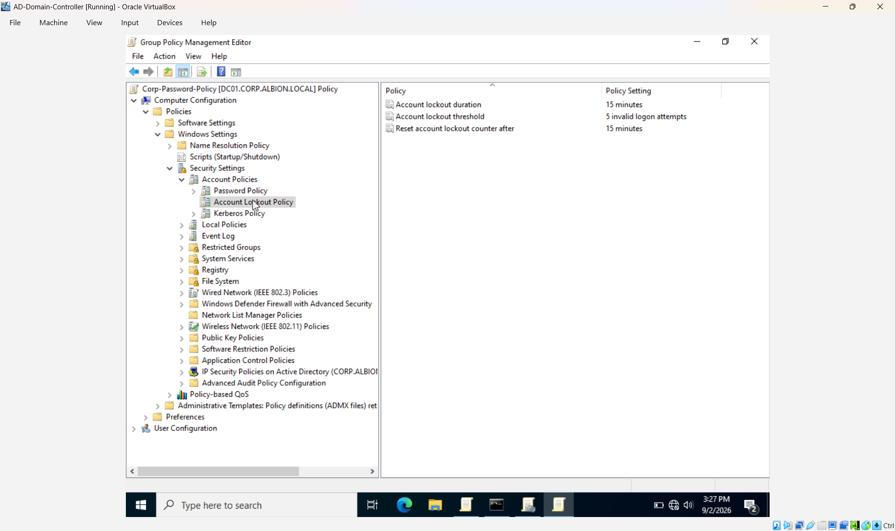
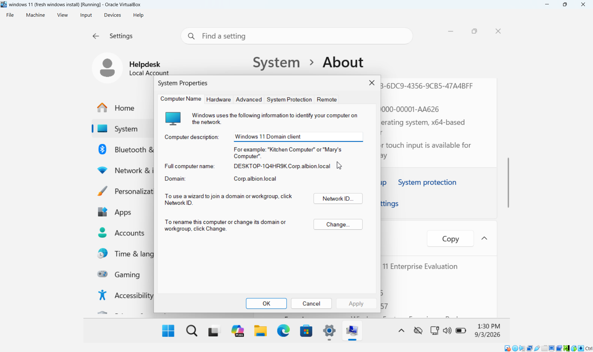
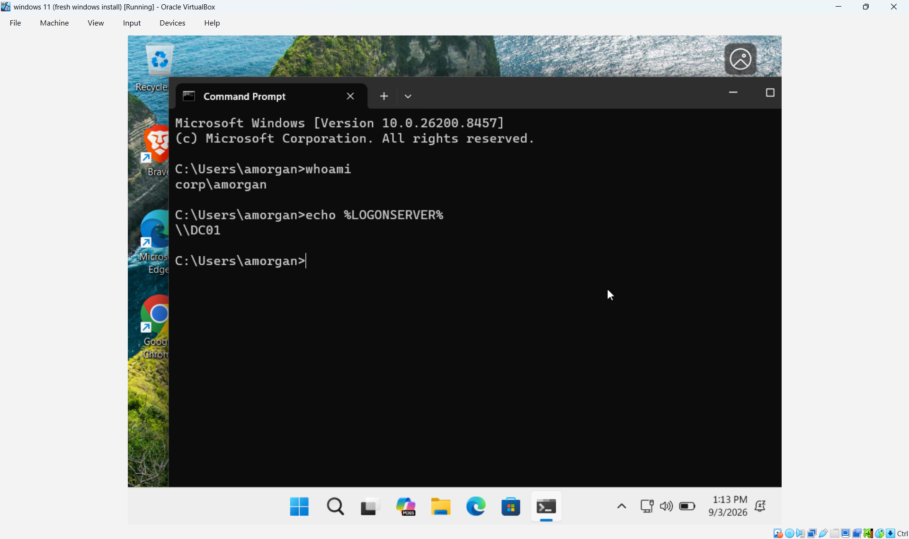

# Windows IT Support & Active Directory Lab

A hands-on Windows IT support and Active Directory administration lab designed to demonstrate practical experience with **Windows Server 2022, Active Directory Domain Services (AD DS), DNS, Group Policy, Windows 11, user administration, security groups, domain authentication, and troubleshooting**.

This project simulates a small business Windows environment where an IT support technician is responsible for deploying and managing a domain controller, configuring users and groups, joining workstations to the domain, implementing security policies, and verifying the environment.

> **Project Type:** Independent Hands-On Lab
> **Focus:** IT Support · Active Directory · Windows Administration · DNS · Group Policy · Troubleshooting
> **Environment:** Windows Server 2022 + Windows 11
> **Virtualization:** Oracle VirtualBox
> **Status:** Core lab implementation completed

---

## 📌 Project Overview

The goal of this project was to build a realistic Windows domain environment from the ground up and practice common tasks performed by **IT Support Technicians, Service Desk Analysts, Desktop Support Technicians, and Junior System Administrators**.

The lab includes:

* Windows Server 2022 domain controller
* Active Directory Domain Services
* Internal DNS
* Windows 11 domain-joined workstation
* Organizational Units (OUs)
* Domain user accounts
* Security groups
* Group Policy
* Password security policies
* Account lockout policies
* Static IP addressing
* DNS configuration
* Domain authentication
* Active Directory computer management
* Windows troubleshooting and verification

The project was built independently as a hands-on portfolio project to demonstrate practical Windows infrastructure and IT support skills.

---

# 🏢 Business Scenario

The environment represents a fictional organization called **Albion University**.

The organization requires centralized management of employee identities, computers, authentication, and security policies.

As the IT support administrator, the objective was to build a Windows domain environment that allows users and computers to be centrally managed through Active Directory.

---

# 🖥️ Lab Architecture

The lab consists of two virtual machines running in Oracle VirtualBox.

```text
                         ┌─────────────────────────────┐
                         │      Windows Server 2022    │
                         │                             │
                         │ Hostname: DC                │
                         │ IP: 192.168.56.20           │
                         │                             │
                         │ Active Directory            │
                         │ DNS Server                  │
                         │ Group Policy                │
                         └──────────────┬──────────────┘
                                        │
                                Host-Only Network
                                  192.168.56.0/24
                                        │
                         ┌──────────────┴──────────────┐
                         │         Windows 11          │
                         │         Client VM            │
                         │                             │
                         │ IP: 192.168.56.10           │
                         │ Domain: corp.albion.local   │
                         └─────────────────────────────┘
```

### Virtual Network

Each virtual machine uses:

* **Host-Only Adapter** — internal communication between the lab machines
* **NAT Adapter** — internet connectivity

The Host-Only network provides an isolated environment for Active Directory, DNS, and domain communication.

---

# 🌐 Network Configuration

| Device              | Hostname | IP Address      | DNS             |
| ------------------- | -------- | --------------- | --------------- |
| Windows Server 2022 | `DC`     | `192.168.56.20` | `192.168.56.20` |
| Windows 11          | Client   | `192.168.56.10` | `192.168.56.20` |

Subnet:

```text
192.168.56.0/24
```

Subnet mask:

```text
255.255.255.0
```

The Windows 11 client uses the domain controller as its DNS server so that it can resolve the internal Active Directory domain.

---

# 🔧 Technologies Used

### Operating Systems

* Windows Server 2022
* Windows 11

### Microsoft Technologies

* Active Directory Domain Services
* DNS
* Group Policy
* Active Directory Users and Computers
* Group Policy Management
* Windows domain authentication

### Virtualization

* Oracle VirtualBox

### Administration & Troubleshooting

* Command Prompt
* PowerShell
* `ipconfig`
* `ping`
* `nslookup`
* `whoami`
* `gpupdate`
* `gpresult`

---

# 🚀 Implementation & Steps Performed

## 1. Windows Server 2022 Deployment

The first step was deploying a Windows Server 2022 virtual machine to act as the domain controller.

### Configuration performed

* Installed Windows Server 2022
* Configured the server hostname as `DC`
* Configured the Host-Only network adapter
* Assigned a static IP address
* Configured DNS
* Installed the Active Directory Domain Services role
* Installed the DNS Server role
* Promoted the server to a domain controller
* Created the `corp.albion.local` Active Directory domain

### Server Configuration

```text
Hostname:       DC
Operating System: Windows Server 2022
IP Address:     192.168.56.20
Subnet Mask:    255.255.255.0
Domain:         corp.albion.local
```

### Verification

The server baseline and configuration were captured during the implementation.



---

# 2. Static IP & DNS Configuration

A static IP address was configured on the domain controller to provide a consistent address for Active Directory and DNS services.

The Windows 11 workstation was configured to use the domain controller as its DNS server.

### Windows Server

```text
IP Address:      192.168.56.20
Subnet Mask:     255.255.255.0
DNS Server:      192.168.56.20
```

### Windows 11

```text
IP Address:      192.168.56.10
Subnet Mask:     255.255.255.0
DNS Server:      192.168.56.20
```

The Host-Only adapter does not use a default gateway because it is dedicated to internal lab communication.

### Verification

The IP and DNS configuration was verified on the Windows environment.



---

# 3. Active Directory Domain Services

Active Directory Domain Services was configured on the Windows Server.

The domain created for the lab is:

```text
corp.albion.local
```

The NetBIOS domain name is:

```text
CORP
```

The domain controller is:

```text
DC
```

Active Directory provides centralized management of:

* User accounts
* Computer accounts
* Security groups
* Authentication
* Organizational Units
* Group Policy

---

# 4. Organizational Unit Structure

The Active Directory environment was organized using Organizational Units to represent different departments.

```text
corp.albion.local
│
├── Users
│   ├── IT
│   ├── HR
│   ├── Finance
│   └── Sales
│
└── Groups
```

This structure provides logical organization for user accounts and creates a foundation for applying administrative policies.

---

# 5. User Account Creation

Test users were created to simulate employees within the organization.

| Employee      | Username  | Department |
| ------------- | --------- | ---------- |
| Alex Morgan   | `amorgan` | IT         |
| Taylor Morgan | `tmorgan` | HR         |
| Jordan Lee    | `jlee`    | Finance    |
| Sarah Chen    | `schen`   | Sales      |

The accounts were placed into their appropriate Organizational Units.

### Skills practiced

* Creating domain user accounts
* Configuring usernames
* Managing user objects
* Organizing users using OUs
* Preparing accounts for domain authentication

---

# 6. Security Group Configuration

Security groups were created to represent different organizational roles.

| Security Group  | Purpose                 |
| --------------- | ----------------------- |
| `IT-Admins`     | IT administrative users |
| `IT-Support`    | IT support users        |
| `HR-Users`      | HR users                |
| `Finance-Users` | Finance users           |
| `Sales-Users`   | Sales users             |

### Group Membership

```text
IT-Admins
└── Alex Morgan

IT-Support
└── Alex Morgan

HR-Users
└── Taylor Morgan

Finance-Users
└── Jordan Lee

Sales-Users
└── Sarah Chen
```

The groups were configured as **Global Security Groups**.

This demonstrates the use of group-based administration rather than assigning access individually to every user.

---

# 7. Group Policy Configuration

A domain Group Policy Object named:

```text
Corp-Password-Policy
```

was created and linked to the domain.

The policy was configured to establish password and account lockout requirements.

## Password Policy

| Setting                  | Configuration |
| ------------------------ | ------------- |
| Enforce password history | 5 passwords   |
| Maximum password age     | 90 days       |
| Minimum password age     | 1 day         |
| Minimum password length  | 8 characters  |
| Password complexity      | Enabled       |
| Reversible encryption    | Disabled      |

### Verification

The configured password policy was captured as evidence.



---

# 8. Account Lockout Policy

Account lockout controls were configured as part of the domain security policy.

| Setting                      | Configuration      |
| ---------------------------- | ------------------ |
| Account lockout threshold    | 5 invalid attempts |
| Account lockout duration     | 15 minutes         |
| Reset failed-attempt counter | 15 minutes         |

These settings help protect domain accounts against repeated incorrect authentication attempts.

### Verification

The configured account lockout policy was captured as evidence.



---

# 9. Windows 11 Domain Join

The Windows 11 virtual machine was configured to communicate with the domain controller and subsequently joined to:

```text
corp.albion.local
```

### Steps performed

1. Configured the Windows 11 network adapter.
2. Assigned the required IP configuration.
3. Configured the domain controller as the DNS server.
4. Verified DNS resolution.
5. Opened Windows System Properties.
6. Changed the workstation from a workgroup to the domain.
7. Entered domain credentials.
8. Restarted the workstation.
9. Verified that the workstation was joined to the domain.

### Verification

The Windows 11 system confirmed membership in the domain.



---

# 10. Domain Authentication Verification

After joining Windows 11 to the domain, a domain user account was used to authenticate to the workstation.

The test account used was:

```text
CORP\amorgan
```

Authentication was verified using Windows command-line tools.

### Commands used

```text
whoami
```

and:

```text
echo %LOGONSERVER%
```

These commands were used to identify the logged-in domain account and the domain controller responsible for authentication.

### Verification



This confirms the Windows 11 workstation was able to authenticate using the Active Directory domain account.

---

# 11. Active Directory Computer Account Verification

After joining the Windows 11 workstation to the domain, the corresponding computer account was verified in **Active Directory Users and Computers**.

### Steps performed

1. Opened Active Directory Users and Computers.
2. Navigated to the domain.
3. Opened the Computers container.
4. Located the Windows 11 workstation.
5. Verified that the computer account existed in Active Directory.

### Verification


This demonstrates the relationship between a domain-joined workstation and its computer account in Active Directory.

---

# 12. DNS Verification

DNS is a critical dependency for Active Directory.

The Windows 11 client was configured to use:

```text
192.168.56.20
```

as its DNS server.

DNS resolution was tested using:

```text
nslookup DC
```

and:

```text
nslookup corp.albion.local
```

Successful DNS resolution is important for:

* Domain joining
* Domain authentication
* Locating domain controllers
* Active Directory communication
* Group Policy processing

---

# 13. Connectivity Verification

Network connectivity between the Windows 11 workstation and the domain controller was tested using ICMP.

Example:

```text
ping 192.168.56.20
```

This verifies basic IP connectivity between the client and domain controller.

Additional troubleshooting commands used during the lab included:

```text
ipconfig /all
```

```text
nslookup DC
```

```text
nslookup corp.albion.local
```

```text
whoami
```

These commands provide useful information when troubleshooting Windows domain and network issues.

---

# 🧪 IT Support Troubleshooting Methodology

The lab follows a structured troubleshooting methodology:

```text
Identify
   ↓
Investigate
   ↓
Isolate
   ↓
Resolve
   ↓
Verify
   ↓
Document
```

This approach can be applied to common IT support incidents.

### Example: Domain Login Failure

Investigate:

```text
whoami
```

Then check:

* Username
* Domain
* Network connectivity
* DNS configuration
* Domain controller availability
* Account status

### Example: Domain Join Failure

Check:

```text
ipconfig /all
```

```text
nslookup corp.albion.local
```

```text
ping 192.168.56.20
```

Potential causes include:

* Incorrect DNS configuration
* Incorrect IP address
* Domain controller unavailable
* Network connectivity problems
* Incorrect domain name

### Example: Group Policy Issue

Use:

```text
gpupdate /force
```

and:

```text
gpresult /r
```

to refresh and inspect Group Policy processing.

---

# 🔐 Security Concepts

The lab demonstrates several fundamental Windows security concepts:

* Centralized identity management
* Domain-based authentication
* Security group management
* Password complexity requirements
* Password expiration
* Account lockout protection
* Organizational Unit structure
* Centralized Group Policy
* Role-based group membership

In a production environment, these concepts would be supplemented with additional controls such as MFA, endpoint protection, auditing, privileged access management, and least-privilege administration.

---

# 📸 Verification Evidence

The repository contains evidence from the actual lab implementation.

### Server Baseline


### Static IP & DNS


### Domain Join


### Domain Authentication


### Computer Account in Active Directory


### Password Policy


### Account Lockout Policy


---

# 📈 Future Lab Improvements

The current project provides the foundation for additional Windows administration and IT support scenarios.

Planned improvements include:

* Group Policy verification using `gpresult`
* File and folder permissions
* NTFS and shared-folder permissions
* Network drive configuration
* Additional Group Policy configurations
* Windows Event Viewer troubleshooting
* PowerShell administration
* User onboarding and offboarding
* Software deployment
* Remote administration
* Printer management
* Additional Windows troubleshooting scenarios

These are planned extensions and are not represented as completed functionality in the current lab.

---

# 📂 Repository Structure

```text
Windows-IT-Support-Active-Directory-Lab/
│
├── README.md
│
├── screenshots/
│   ├── 01-server-baseline.png
│   ├── 02-static-ip-dns.png
│   ├── 03-domain-join.png
│   ├── 04-domain-login-verification.png
│   ├── 05-domain-computer-in-ad.png
│   ├── 07-password-policy.png
│   └── 07b-account-lockout-policy.png
│
└── ...
```

---

# 🎯 Skills Demonstrated

## Windows Administration

* Windows Server 2022
* Windows 11
* Active Directory Domain Services
* DNS
* Group Policy
* User administration
* Computer account management
* Security group management
* Domain authentication

## Networking

* IPv4 addressing
* Static IP configuration
* DNS configuration
* Host-Only networking
* Network connectivity testing
* Basic TCP/IP troubleshooting

## IT Support

* Windows troubleshooting
* Domain login troubleshooting
* DNS troubleshooting
* Domain join troubleshooting
* Group Policy troubleshooting
* User and account administration
* Structured incident investigation
* Technical documentation
* Evidence-based verification

## Tools

* Oracle VirtualBox
* Active Directory Users and Computers
* Group Policy Management
* Command Prompt
* PowerShell
* Windows administrative tools

---

# 💼 Portfolio Relevance

This project demonstrates practical experience relevant to entry-level roles such as:

* **IT Support Technician**
* **Service Desk Analyst**
* **Help Desk Analyst**
* **Desktop Support Technician**
* **Technical Support Specialist**
* **MSP Support Technician**
* **Junior System Administrator**
* **Junior IT Infrastructure Technician**

Instead of simply listing Active Directory, DNS, Windows, and Group Policy as skills, this project demonstrates how these technologies were configured, used, and verified in a controlled environment.

---

# 🧠 Key Takeaways

This project strengthened my practical understanding of Windows infrastructure and enterprise IT support.

Key areas practiced include:

* Deploying Windows Server
* Configuring Active Directory
* Configuring DNS
* Creating and managing users
* Organizing users with OUs
* Creating security groups
* Joining Windows 11 to a domain
* Verifying domain authentication
* Managing computer accounts
* Configuring Group Policy
* Implementing password policies
* Implementing account lockout policies
* Troubleshooting network and domain connectivity
* Using Windows administration tools
* Documenting technical work with evidence

The project reinforced the importance of combining **configuration, troubleshooting, verification, and documentation** when supporting IT infrastructure.

---

# 👤 About This Project

This is an **independently built hands-on IT administration lab** created to strengthen practical Windows, Active Directory, networking, and troubleshooting skills.

The project is designed as part of my technical portfolio to demonstrate hands-on experience beyond certifications and coursework.

**Focus Areas:**

`IT Support` · `Windows` · `Active Directory` · `DNS` · `Group Policy` · `Troubleshooting` · `Microsoft` · `Networking` · `Virtualization`

---

## 📌 Project Status

| Component                            | Status       |
| ------------------------------------ | ------------ |
| Windows Server 2022                  | ✅ Completed  |
| Active Directory Domain Services     | ✅ Completed  |
| DNS Configuration                    | ✅ Completed  |
| Organizational Units                 | ✅ Completed  |
| User Accounts                        | ✅ Completed  |
| Security Groups                      | ✅ Completed  |
| Windows 11 Domain Join               | ✅ Completed  |
| Domain Authentication                | ✅ Completed  |
| Password Policy                      | ✅ Completed  |
| Account Lockout Policy               | ✅ Completed  |
| Verification Screenshots             | ✅ 7 captured |
| Additional Troubleshooting Scenarios | 🔄 Planned   |
| Group Policy Verification Evidence   | 🔄 Planned   |
